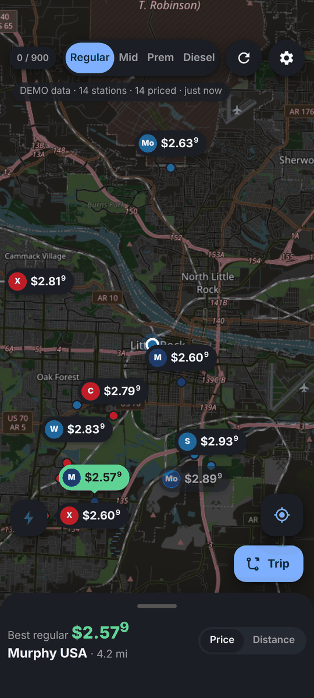
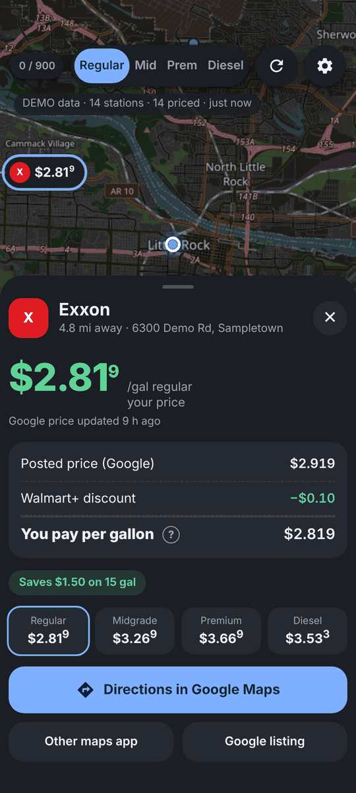
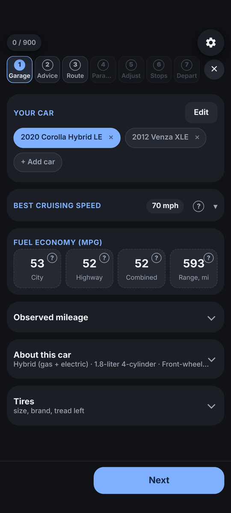
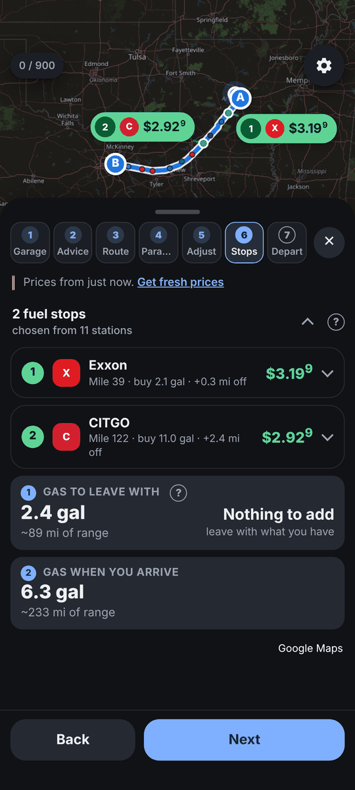

# Gasket

**The cheapest fill-up on your route, after your discounts.**

Gasket is a personal Android app built around the Walmart+ fuel discount. It maps the stations where the discount works (Walmart, Murphy USA, Sam's Club, Exxon, Mobil and CITGO), shows what you'll actually pay per gallon once every discount is taken off, and plans the cheapest fuel stops for a trip you've laid out in Google Maps.


<p>
  
  
  
  
</p>

<sub>Screenshots use demo prices and example cars.</sub>

## What it does

### The map
- Only the stations where your discounts apply, each labeled with **the price you pay**, not the posted one.
- A breakdown for every station: the posted price, each discount (Walmart+ 10¢, Sam's member pricing, Club CITGO tiers that stack at CITGO), and how to claim them at the pump.
- Prices come from Google Places and straight from walmart.com and murphyusa.com. If no source has a price, the station shows up without one; Gasket never asks users to report prices.

### The trip planner
Paste or share a Google Maps directions link and Gasket works through seven steps:

1. **Garage**: your cars, with EPA mileage, range, the best cruising speed for the car, and the mileage you actually get.
2. **Advisory**: open safety recalls for your VIN (checked at NHTSA), engine features worth turning off, and tire wear.
3. **Route**: the stops and route options from your link.
4. **Parameters**: how much gas you have now, how much you want when you arrive, and how fast you'll drive.
5. **Adjustments**: how far you'll leave the route for gas and how much buffer to keep in the tank.
6. **Stops**: the cheapest set of stops and how many gallons to buy at each, weighing price against detour and time.
7. **Departure**: a summary, and the whole trip sent back to Google Maps with the stops added.

It handles round trips and multi-stop trips, speed limits along the way (from FHWA highway data), electric cars (chargers from the DOE station database) and hydrogen cars.

### The Garage
- Add a car by year, make and model, or by VIN (decoded by NHTSA).
- Mileage and versions of a model come from the EPA's fueleconomy.gov. When the EPA lists several versions, Gasket asks which one is yours unless the VIN settles it.
- **About this car** explains the engine, transmission, drivetrain and features in plain words, with the technical term in parentheses.
- **Tires**: the factory size and the tires sold in it come from Tire Rack. Tread left is measured or estimated from miles, the tire's expected life and rotations.

## Design choices

- **No tracking.** Gasket has no analytics, telemetry, ads or account. Settings, cars and trips stay on the phone.
- **Your keys stay yours.** You bring your own Google Maps Platform key. It's kept on the device, scrubbed from logs, and left out of every export.
- **No Google Play services.** Gasket is built for Pixels running GrapheneOS and uses only standard Android APIs.
- **Light on Google.** Lookups are cached, and a monthly cap (900 by default) is shown on screen. Nothing searches by itself when the app opens.
- **Bot checks stay with you.** When a site wants an "are you human?" check, Gasket opens it so you can complete it yourself. A background read that hits a check just stops; Gasket never tries to get past one.
- **Plain words.** Explanations come first; acronyms appear only in parentheses after them.

## How it's built

```
Android app (one Java class, no Gradle)
├─ WebView ──── the whole UI: plain HTML / CSS / JS, no framework, no bundler
│               Leaflet + OpenStreetMap tiles for maps
├─ Native ───── a small JavaScript bridge: location, storage, sharing, backups
└─ Hidden site windows ── read walmart.com, murphyusa.com, Google Maps links,
                          NHTSA and Tire Rack pages through injected scripts
```

- `src/com/bensanzone/fuelmap/MainActivity.java`: the only Java class. It hosts the WebView and the `Native` bridge.
- `assets/web/`: the UI. `trip.js` (route math and stop planning) is pure logic that also runs in Node. `app.js` has a desktop stand-in for `Native`, so the whole UI runs in Chrome.
- `assets/*_worker.js`: the scripts injected into the hidden site windows.
- `build.sh`: builds the APK with the Android SDK tools directly (aapt → javac → dx → zipalign → apksigner), with no Gradle.

## Building and testing

You need the Android SDK as Debian and Ubuntu package it (`android-sdk`, which `build.sh` expects under `/usr/lib/android-sdk`), a JDK, Node.js, and Python with Playwright and Chrome or Chromium.

```sh
# a signed APK (your own keystore; see SIGNING.md)
KEYSTORE=/path/to/your.jks KS_PASS=… ./build.sh

# every test: Node unit tests plus Playwright UI tests at two phone sizes, in parallel (about 2 minutes)
tests/run_all.sh /tmp/shots

# only some of them, without screenshots
NO_SCREENSHOTS=1 tests/run_all.sh /tmp/shots trip_ui garage
```

The UI tests check every step at 320–448 px wide and at 130% text size for sideways scrolling. To try the UI without a phone, open `assets/web/index.html` in Chrome and turn on demo data in Settings.

## Status

Gasket is in **alpha** and built for its author's own use. Releases on GitHub contain **source code only**; there are no APK downloads. It will be published once there's a beta release candidate, after the open terms-of-service questions in [`COMPLIANCE.md`](COMPLIANCE.md) are settled.

Gasket was called **Fuel+ Map** until version 0.0.47. It still restores Fuel+ backups and imports Fuel+ exports and shared trips.

## Documentation

| File | What's in it |
|---|---|
| [`CHANGELOG.md`](CHANGELOG.md) | What changed in every version |
| [`VERSIONING.md`](VERSIONING.md) | Version numbers and how releases are made |
| [`SIGNING.md`](SIGNING.md) | How the release key is made, stored and used |
| [`COMPLIANCE.md`](COMPLIANCE.md) | Terms-of-service questions to settle before a public beta |
| [`THIRD_PARTY_NOTICES.md`](THIRD_PARTY_NOTICES.md) | Bundled libraries and data sources, with their licenses |

## License

Gasket is licensed under the [Source First License 1.1](LICENSE.md): you may read, run and change it for non-commercial use. © Benjamin Sanzone.

Third-party code keeps its own license: Leaflet (BSD-2-Clause) and the U.S. state outlines from us-atlas (ISC). Data comes from OpenStreetMap contributors (ODbL), Google Maps, the EPA (fueleconomy.gov), NHTSA, FHWA, the DOE Alternative Fuels Data Center and Tire Rack. The full credits are in [`THIRD_PARTY_NOTICES.md`](THIRD_PARTY_NOTICES.md) and in the app under Settings → About.

Gasket isn't affiliated with Walmart, Murphy USA, Sam's Club, ExxonMobil, CITGO, Google or Tire Rack.
